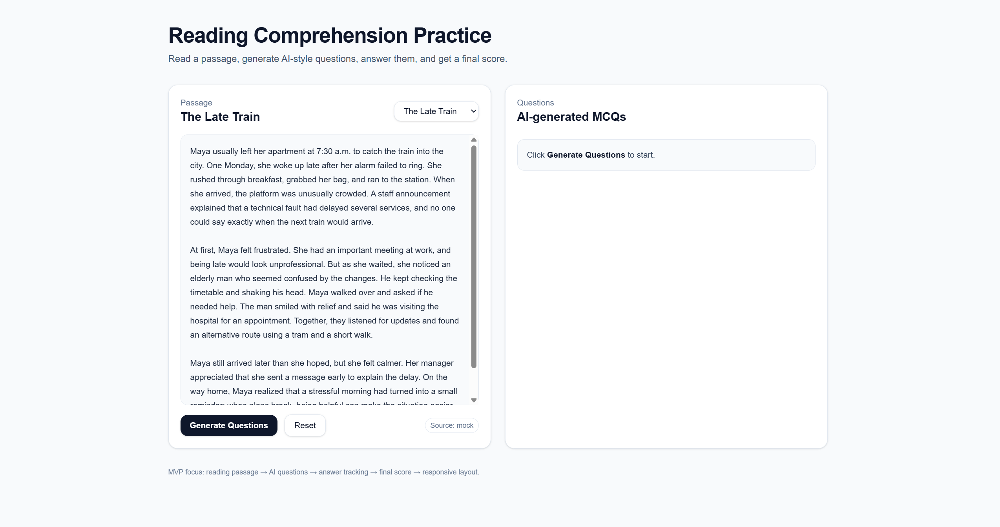
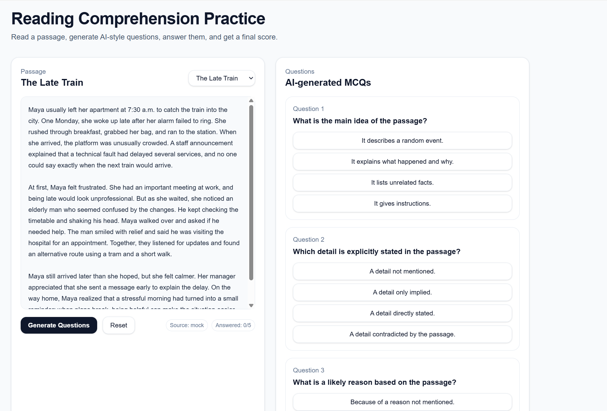

# AI Reading Comprehension Platform

A production-minded full-stack reading comprehension application that generates questions, evaluates answers, and remains reliable even when external AI services are unavailable.

## Demo

### Reading & Question Flow
Students can read a passage, generate comprehension questions, answer them, and receive immediate feedback with a final score.



### AI Question Generation
The system supports deterministic mock generation by default, with optional OpenAI integration for real AI-generated questions.



## Key Highlights

- Built a full-stack React application using **Next.js App Router**, **TypeScript**, and API routes
- Designed a **resilient AI integration layer** with deterministic fallback from mock mode to optional OpenAI usage
- Implemented a complete user workflow: **reading → question generation → answering → scoring**
- Prioritised **production reliability** for local development, CI, restricted networks, and reviewer environments
- Structured the system for **maintainability**, separating UI, AI logic, content, and provider behaviour
- Deployed to production using **Vercel**

---

## Project Overview

This project was designed to improve reading comprehension workflows through a clean, responsive interface and reliable AI-assisted question generation.

The application allows students to:

- read a passage
- generate comprehension questions
- answer questions with immediate feedback
- review explanations and receive a final score

Rather than treating AI as the core dependency, the system was intentionally designed so that the application still works predictably even when external AI services are unavailable.

---

## Why This Project Is Interesting

Many AI-powered student projects work only when an external provider is available. This one was designed differently.

### Key engineering decision:
The application uses **mock generation by default** and supports **OpenAI optionally**.

This means the system:

- always works in development
- remains review-friendly for assessors and recruiters
- behaves predictably in CI and restricted environments
- avoids brittle dependence on network/API availability

This project is therefore not just an AI demo — it is an example of **reliable product-oriented system design**.

---

## Core Features

- Reading passage display with selectable difficulty/length
- AI-generated multiple-choice comprehension questions
- Immediate answer feedback and explanations
- Final score calculation and retry flow
- Responsive design for desktop and mobile
- Loading / disabled states for cleaner UX
- Deterministic fallback generation for stable testing and evaluation

---

## Architecture & Design Decisions

### 1. AI Provider Abstraction

The system separates AI behaviour behind a provider layer so that question generation logic is not tightly coupled to one external service.

This makes it easier to:

- switch providers
- test deterministically
- avoid fragile runtime behaviour
- preserve consistent output during reviews

### 2. Mock-First Reliability Strategy

Mock mode is the default because external AI services may fail or be inaccessible due to:

- network restrictions
- CI environments
- firewall / VPN limitations
- missing API keys

Instead of breaking the product, the application gracefully falls back to deterministic generation.

### 3. Clean Flow Design

The interface was intentionally scoped to support a simple, readable workflow:

1. choose a passage  
2. generate questions  
3. submit answers  
4. review explanations  
5. receive a score  

This keeps the product focused on learning outcomes rather than UI complexity.

---

## Tech Stack

### Frontend
- Next.js (App Router)
- React
- TypeScript
- Tailwind CSS

### Backend / Server Logic
- Next.js API Routes
- OpenAI API (optional)
- Deterministic mock question generator

### Deployment
- Vercel

---

## Project Structure

```text
AI-Reading-Comprehension-Platform/
├── app/
│   ├── api/
│   │   └── generate-questions/
│   │       └── route.ts
│   ├── layout.tsx
│   └── page.tsx
├── lib/
│   ├── ai.ts
│   ├── mock.ts
│   └── passages.ts
├── public/
├── README.md
└── package.json
```

### Key Files

- `app/page.tsx`  
  Main UI for reading, answering, and scoring

- `app/api/generate-questions/route.ts`  
  Server-side question generation endpoint

- `lib/ai.ts`  
  AI provider abstraction and fallback logic

- `lib/mock.ts`  
  Deterministic mock generator for reliable local/review usage

- `lib/passages.ts`  
  Reading passage definitions

---

## Local Setup

Install dependencies:

```bash
npm install
```

Start the development server:

```bash
npm run dev
```

Open in browser:

```bash
http://localhost:3000
```

---

## Configuration

AI behaviour is controlled via environment variables:

```bash
AI_PROVIDER=mock
# AI_PROVIDER=openai
# OPENAI_API_KEY=your_api_key_here
```

### Modes

#### Mock Mode (Default)
- deterministic
- always available
- ideal for development, testing, and review

#### OpenAI Mode
- uses real AI-generated questions
- requires valid API key
- useful for demonstrating live AI behaviour

---

## Production Deployment

This project is deployed on Vercel.

Live demo:  
[AI Reading Comprehension Platform](https://ai-reading-comprehension-platform-psi.vercel.app)

The deployment supports quick review and demonstrates the application in a production environment.

---

## What This Project Demonstrates

This project is intended to demonstrate:

- React / Next.js application development
- TypeScript-based UI and server-side logic
- API route design and separation of concerns
- resilience-oriented AI integration
- product thinking around reliability and reviewability
- clean user flow and maintainable architecture

---

## Final Note

This project was intentionally built not just to “use AI,” but to show how AI features can be integrated into a product responsibly.

The focus was on building something that is:

- usable
- review-friendly
- reliable
- maintainable
- production-minded
